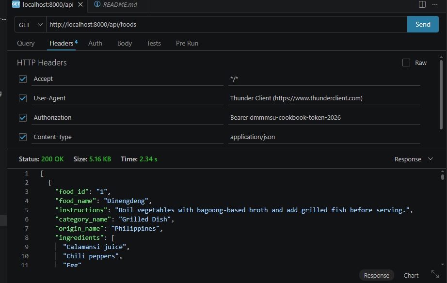
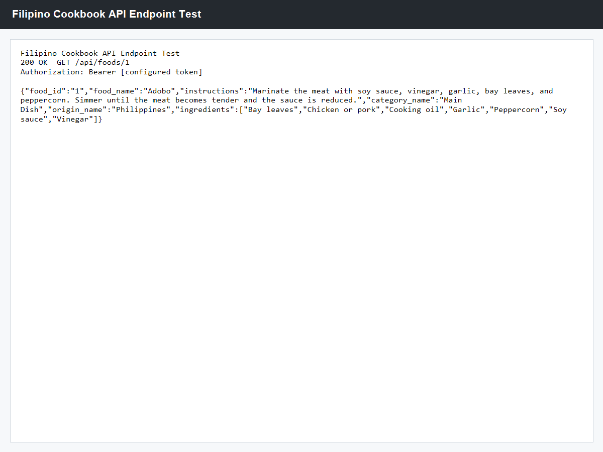
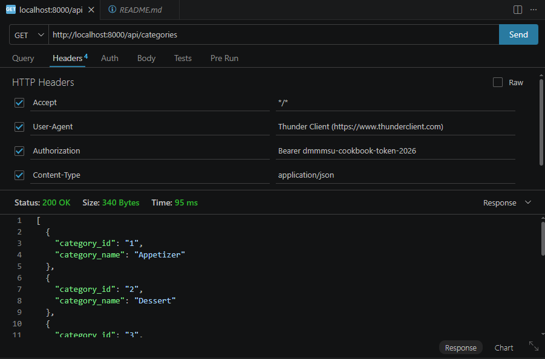
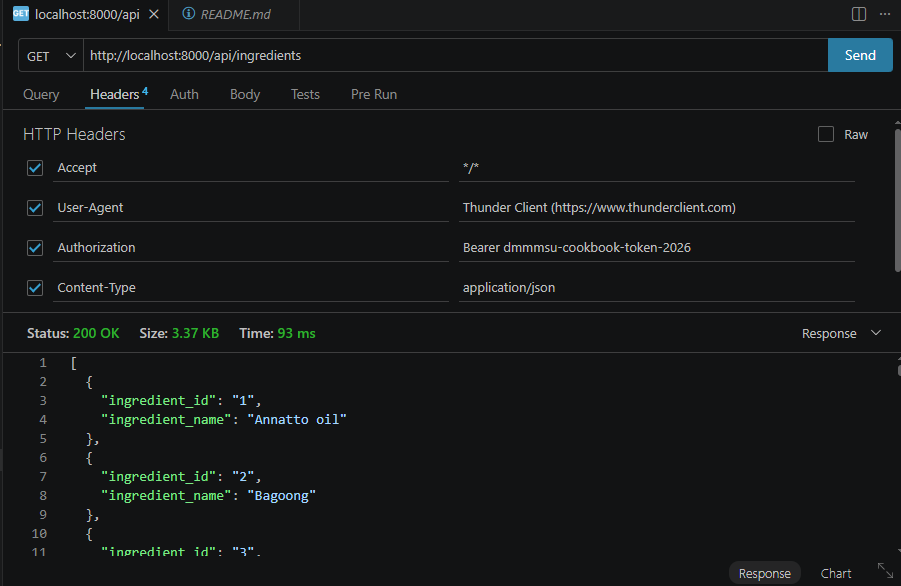
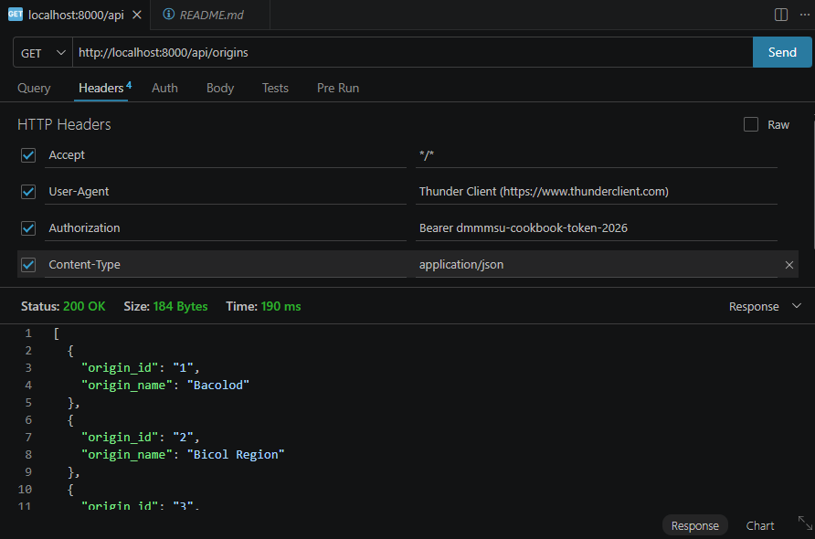
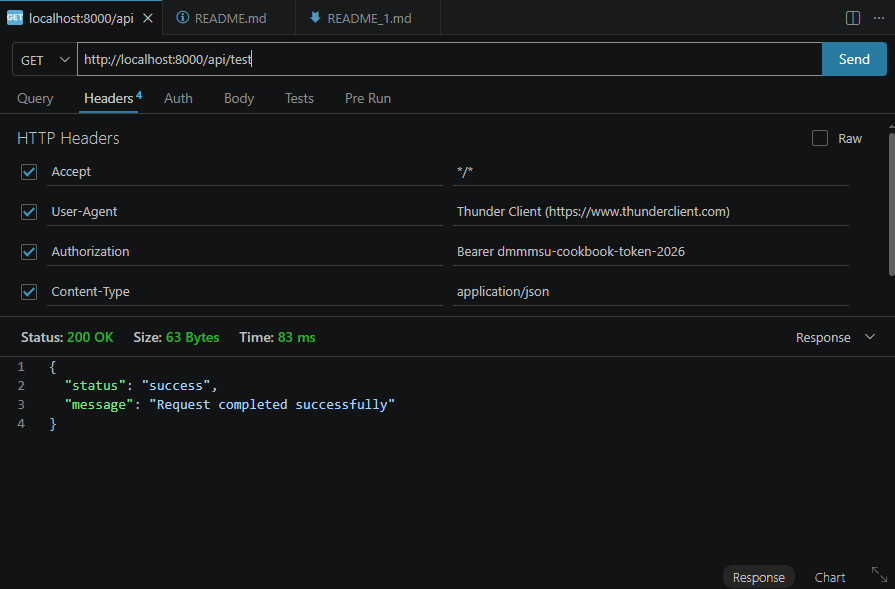
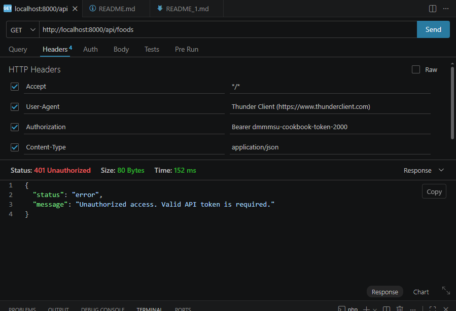
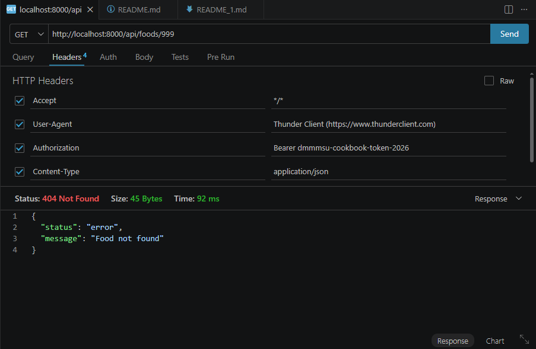
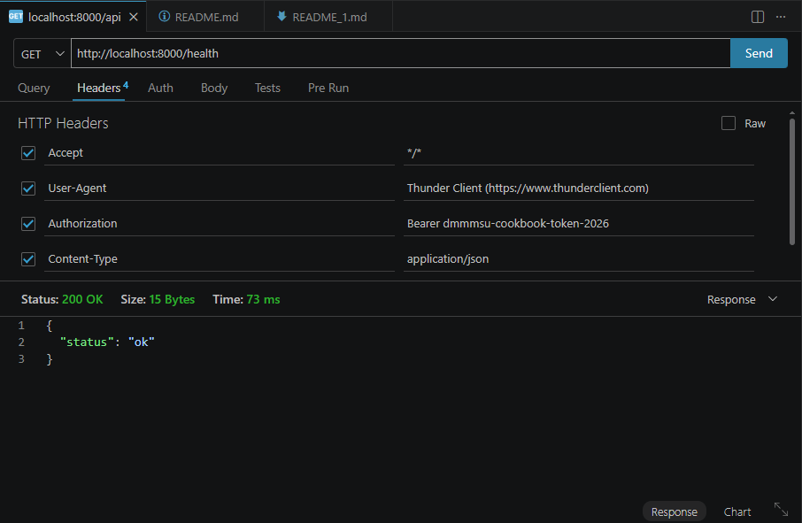

# Filipino Cookbook API

## API Description

The Filipino Cookbook API is a secured REST-style API for viewing and managing Filipino recipe information. It provides structured data about Filipino foods, food categories, regional origins, ingredients, cooking instructions, and ingredient relationships.

This API is intended for students and developers who need a backend service for a cookbook, recipe browser, mobile app, web client, or API client activity. The main functions are retrieving food records, viewing a specific food, searching foods by name, retrieving lookup data, and adding new food records using authenticated requests.

Technologies used include PHP, Slim Framework, MySQL/MariaDB, Composer, JSON, XAMPP/Apache, Thunder Client or Postman, Git, and GitHub.

## Features

- Retrieve Filipino foods.
- Retrieve food categories.
- Retrieve food origins.
- Retrieve ingredients.
- View the details of a specific food.
- Search foods by name.
- Add a new food record.
- Authenticate API requests using a bearer token.
- Return API responses in JSON format.
- Protect private database credentials using `config.php` and `config.example.php`.

## Technologies Used

| Tool | Purpose |
| --- | --- |
| PHP | Main backend programming language |
| Slim Framework | API routing and request handling |
| MySQL/MariaDB | Database storage |
| Composer | PHP dependency management |
| JSON | API response format |
| Apache/XAMPP | Local web server and database server |
| Thunder Client or Postman | API endpoint testing |
| Git | Version control |
| GitHub | Public repository hosting |

## Repository Contents

```text
filipino-cookbook-api-galang/
|-- public/
|   `-- index.php
|-- docs/
|   |-- api-documentation.md
|   |-- endpoint-results/
|   `-- screenshots/
|-- API_DOCUMENTATION.md
|-- README.md
|-- composer.json
|-- composer.lock
|-- config.example.php
|-- database.sql
`-- .gitignore
```

Do not upload `config.php`, `vendor/`, temporary debug files, database passwords, access tokens, or private server credentials.

## Installation Instructions

1. Clone the repository:

   ```bash
   git clone https://github.com/username/filipino-cookbook-api-galang.git
   ```

2. Open the project folder:

   ```bash
   cd filipino-cookbook-api-galang
   ```

3. Install PHP dependencies:

   ```bash
   composer install
   ```

4. Start Apache and MySQL in XAMPP.

5. Import the database.

   In Command Prompt:

   ```cmd
   C:\xampp\mysql\bin\mysql.exe -u root < database.sql
   ```

   In PowerShell:

   ```powershell
   cmd /c "C:\xampp\mysql\bin\mysql.exe -u root < database.sql"
   ```

   If your MySQL root user has a password, use:

   ```powershell
   cmd /c "C:\xampp\mysql\bin\mysql.exe -u root -p < database.sql"
   ```

6. Create the local configuration file:

   ```cmd
   copy config.example.php config.php
   ```

7. Edit `config.php` using your local database account and API token:

   ```php
   <?php

   return [
       'db_host' => 'localhost',
       'db_name' => 'filipino_cookbook_api',
       'db_user' => 'root',
       'db_pass' => '',
       'api_token' => 'YOUR_ACCESS_TOKEN',
   ];
   ```

8. Start the local PHP server:

   ```bash
   php -S localhost:8000 -t public
   ```

9. Test the health endpoint:

   ```text
   http://localhost:8000/health
   ```

10. Test authenticated API endpoints using Thunder Client or Postman.

## Database Setup

Database name:

```text
filipino_cookbook_api
```

SQL file:

```text
database.sql
```

Main tables:

| Table | Description |
| --- | --- |
| `categories` | Stores food category records such as Main Dish, Soup, Dessert, and Appetizer |
| `origins` | Stores regional or place origin records such as Philippines, Ilocos Region, Bicol Region, and Bacolod |
| `ingredients` | Stores ingredient names used by foods |
| `foods` | Stores food names, category IDs, origin IDs, and cooking instructions |
| `food_ingredients` | Junction table that connects foods to one or more ingredients |

Relationship summary:

```text
categories -> foods <- origins
foods -> food_ingredients <- ingredients
```

Each food belongs to one category and one origin. Each food can have many ingredients. The `food_ingredients` table creates the many-to-many relationship between `foods` and `ingredients`.

## Base URL

Using the PHP built-in server:

```text
http://localhost:8000
```

Using Apache/XAMPP with the project inside `htdocs`:

```text
http://localhost/filipino-cookbook-api-galang/public
```

The API routes are under:

```text
/api
```

Example:

```text
http://localhost:8000/api/foods
```

## Authentication Instructions

All `/api` endpoints require bearer token authentication.

The local API token is configured in:

```text
config.php
```

The public repository should only include:

```text
config.example.php
```

Required request header:

```text
Authorization: Bearer YOUR_ACCESS_TOKEN
Accept: application/json
```

The word `Bearer` is placed only in the request header. In `config.php`, save only the token value.

Correct `config.php` example:

```php
'api_token' => 'YOUR_ACCESS_TOKEN',
```

Correct request header example:

```text
Authorization: Bearer YOUR_ACCESS_TOKEN
```

Missing or invalid token response:

```json
{
  "status": "error",
  "message": "Unauthorized access. Valid API token is required."
}
```

## Endpoint Documentation

### GET /

Description: Returns a welcome message for the API.

Required headers: None

Example request:

```text
GET http://localhost:8000/
```

Example successful response:

```json
{
  "message": "Welcome to the Secured Filipino Cookbook API",
  "note": "Use a valid Bearer token to access /api endpoints."
}
```

### GET /health

Description: Checks if the API service is running.

Required headers: None

Example request:

```text
GET http://localhost:8000/health
```

Example successful response:

```json
{
  "status": "ok"
}
```

### GET /api/test

Description: Confirms that the database connection and bearer token are working.

Required headers:

```text
Authorization: Bearer YOUR_ACCESS_TOKEN
Accept: application/json
```

Example request:

```text
GET http://localhost:8000/api/test
```

Example successful response:

```json
{
  "status": "success",
  "message": "Request completed successfully"
}
```

Example error response:

```json
{
  "status": "error",
  "message": "Unauthorized access. Valid API token is required."
}
```

### GET /api/foods

Description: Returns all Filipino foods stored in the database with category, origin, instructions, and ingredients.

Required headers:

```text
Authorization: Bearer YOUR_ACCESS_TOKEN
Accept: application/json
```

Example request:

```text
GET http://localhost:8000/api/foods
```

Example successful response:

```json
[
  {
    "food_id": "1",
    "food_name": "Adobo",
    "instructions": "Marinate the meat with soy sauce, vinegar, garlic, bay leaves, and peppercorn. Simmer until the meat becomes tender and the sauce is reduced.",
    "category_name": "Main Dish",
    "origin_name": "Philippines",
    "ingredients": [
      "Bay leaves",
      "Chicken or pork",
      "Cooking oil",
      "Garlic",
      "Peppercorn",
      "Soy sauce",
      "Vinegar"
    ]
  }
]
```

### GET /api/foods/{id}

Description: Returns the details of a specific food by ID.

Required headers:

```text
Authorization: Bearer YOUR_ACCESS_TOKEN
Accept: application/json
```

Example request:

```text
GET http://localhost:8000/api/foods/1
```

Example successful response:

```json
{
  "food_id": "1",
  "food_name": "Adobo",
  "instructions": "Marinate the meat with soy sauce, vinegar, garlic, bay leaves, and peppercorn. Simmer until the meat becomes tender and the sauce is reduced.",
  "category_name": "Main Dish",
  "origin_name": "Philippines",
  "ingredients": [
    "Bay leaves",
    "Chicken or pork",
    "Cooking oil",
    "Garlic",
    "Peppercorn",
    "Soy sauce",
    "Vinegar"
  ]
}
```

Example not-found response:

```json
{
  "status": "error",
  "message": "Food not found"
}
```

### GET /api/foods/search/{name}

Description: Searches foods by name.

Required headers:

```text
Authorization: Bearer YOUR_ACCESS_TOKEN
Accept: application/json
```

Example request:

```text
GET http://localhost:8000/api/foods/search/adobo
```

Example successful response:

```json
[
  {
    "food_id": "1",
    "food_name": "Adobo",
    "instructions": "Marinate the meat with soy sauce, vinegar, garlic, bay leaves, and peppercorn. Simmer until the meat becomes tender and the sauce is reduced.",
    "category_name": "Main Dish",
    "origin_name": "Philippines",
    "ingredients": [
      "Bay leaves",
      "Chicken or pork",
      "Cooking oil",
      "Garlic",
      "Peppercorn",
      "Soy sauce",
      "Vinegar"
    ]
  }
]
```

### GET /api/categories

Description: Returns all food categories.

Required headers:

```text
Authorization: Bearer YOUR_ACCESS_TOKEN
Accept: application/json
```

Example request:

```text
GET http://localhost:8000/api/categories
```

Example successful response:

```json
[
  {
    "category_id": "1",
    "category_name": "Appetizer"
  },
  {
    "category_id": "4",
    "category_name": "Main Dish"
  }
]
```

### GET /api/origins

Description: Returns all food origins.

Required headers:

```text
Authorization: Bearer YOUR_ACCESS_TOKEN
Accept: application/json
```

Example request:

```text
GET http://localhost:8000/api/origins
```

Example successful response:

```json
[
  {
    "origin_id": "1",
    "origin_name": "Bacolod"
  },
  {
    "origin_id": "4",
    "origin_name": "Philippines"
  }
]
```

### GET /api/ingredients

Description: Returns all ingredients.

Required headers:

```text
Authorization: Bearer YOUR_ACCESS_TOKEN
Accept: application/json
```

Example request:

```text
GET http://localhost:8000/api/ingredients
```

Example successful response:

```json
[
  {
    "ingredient_id": "1",
    "ingredient_name": "Annatto oil"
  },
  {
    "ingredient_id": "26",
    "ingredient_name": "Garlic"
  }
]
```

### POST /api/foods

Description: Adds a new food record and links it to existing ingredients.

Required headers:

```text
Authorization: Bearer YOUR_ACCESS_TOKEN
Accept: application/json
Content-Type: application/json
```

Example request:

```text
POST http://localhost:8000/api/foods
```

Example JSON body:

```json
{
  "food_name": "Sample Dish",
  "category_id": 1,
  "origin_id": 4,
  "instructions": "Cook and serve.",
  "ingredient_ids": [1, 2]
}
```

Example successful response:

```json
{
  "status": "success",
  "message": "Food added successfully."
}
```

Example validation error:

```json
{
  "status": "error",
  "message": "food_name is required."
}
```

## HTTP Status Codes

| Status Code | Meaning |
| --- | --- |
| 200 | Request completed successfully |
| 201 | New food record was created successfully |
| 400 | Invalid request body, invalid JSON, missing required value, or invalid parameter |
| 401 | Missing or invalid authentication token |
| 403 | Access is not allowed |
| 404 | Requested resource or route was not found |
| 429 | Too many requests |
| 500 | Internal server error |
| 503 | Database connection is unavailable |

## Testing Evidence

Successful endpoint JSON outputs are saved in:

```text
docs/endpoint-results/
```

Screenshots are saved in:

```text
docs/screenshots/
```

## Screenshots of Successful Testing

*Retrieve All Foods:*



*Retrieve a Single Food:*



*Retrieve Categories:*



*Retrieve Ingredients:*



*Retrieve Origins:*



*Authenticated Test Endpoint:*



*Unauthorized Access (Invalid Token):*



*Food Not Found:*



*Health Check:*



## Developer Information

| Field | Details |
| --- | --- |
| Student Name | [Jamel J. Galang] |
| Course and Section | [Bachelor of Science in Information Technology - 4A] |
| GitHub Username | [jamelgalang88] |
| Repository Link | https://github.com/jamelgalang88/filipino-cookbook-api-galang/tree/main |
| Date Completed | July 30, 2026 |
